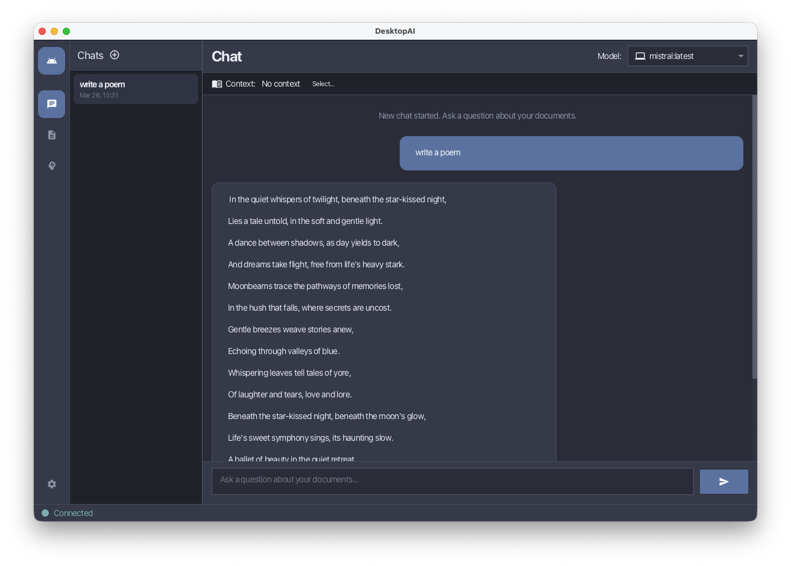
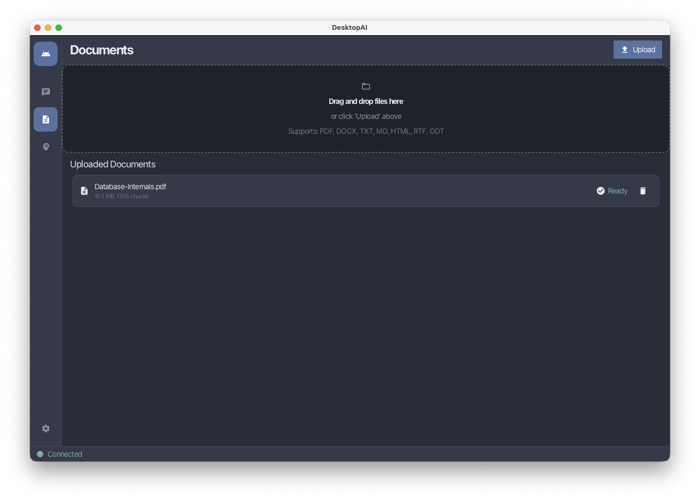
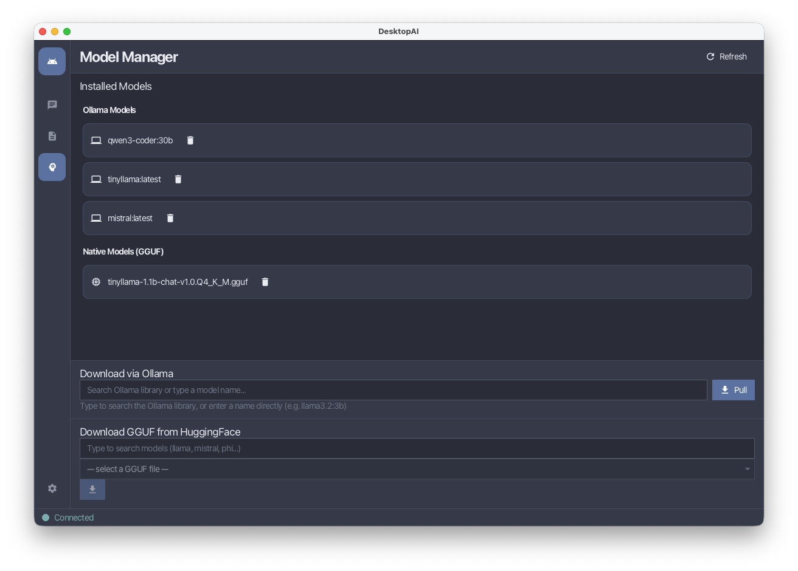
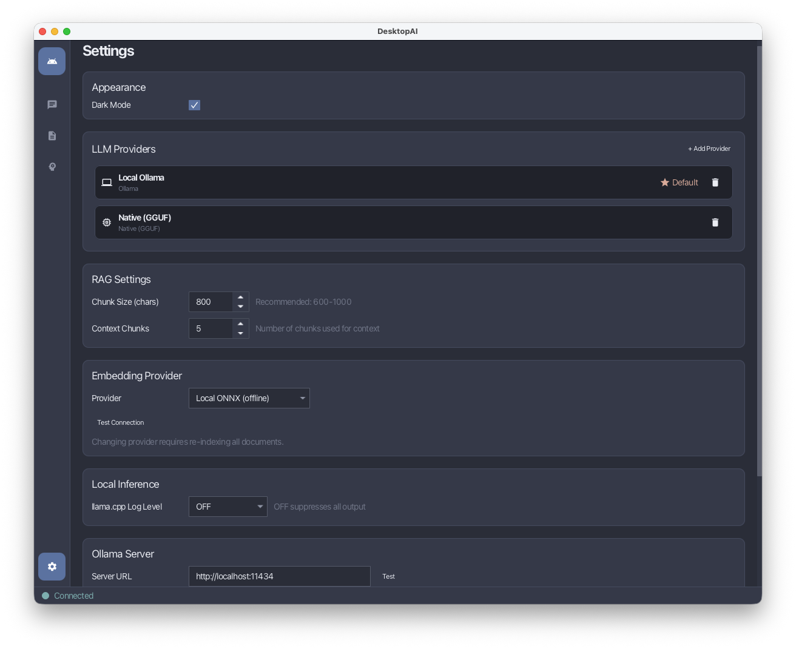
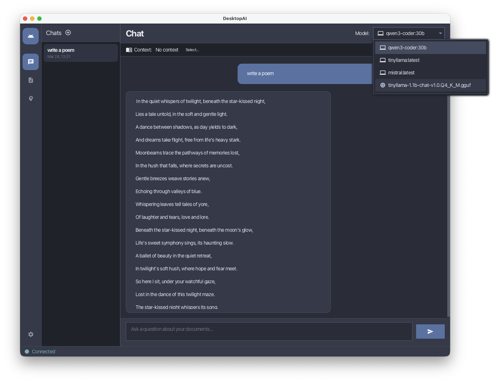

# DesktopAI

A cross-platform JavaFX desktop application that lets you chat with local and cloud LLMs, with optional Retrieval-Augmented Generation (RAG) over your own documents.

## Features

- **Multiple LLM Providers** — Ollama (local), Native GGUF (llama.cpp), OpenAI, Anthropic, and custom OpenAI-compatible endpoints
- **RAG Pipeline** — Upload PDF, Word, text, HTML documents; they are chunked, embedded with all-MiniLM-L6-v2, and retrieved semantically at chat time
- **Multi-turn Conversations** — Full conversation history stored in SQLite, passed natively to each provider
- **Model Manager** — Pull Ollama models and browse/download GGUF models directly from HuggingFace
- **Cross-platform** — Runs on macOS, Linux, and Windows
- **AtlantaFX Nord theme** — Light/dark mode toggle

## Requirements

| Dependency | Minimum Version |
|---|---|
| Java (JDK) | 25 |
| Maven | 3.8+ (or use the included `mvnw` wrapper) |

> No pre-installed JavaFX required — Maven downloads it automatically.

## Quick Start

```bash
# Clone the repository
git clone https://github.com/your-username/DesktopAi.git
cd DesktopAi

# Run with Maven wrapper (no system Maven needed)
./mvnw javafx:run          # macOS / Linux
mvnw.cmd javafx:run        # Windows
```

## Using Ollama (local models, no API key needed)

1. Install [Ollama](https://ollama.ai) for your platform
2. Start Ollama: `ollama serve`
3. Launch DesktopAI — the default Ollama provider connects to `http://localhost:11434`
4. Open **Models** tab → enter a model name (e.g. `llama3.2:3b`) → click **Download**

## Using Native GGUF Models (llama.cpp)

1. Open **Models** tab → search HuggingFace or paste a direct `.gguf` URL
2. Downloaded models are saved to `~/.desktopai/models/`
3. Select the model from the chat model selector and start chatting

## Using Cloud Providers (OpenAI / Anthropic)

1. Open **Settings** → **Add Provider**
2. Select the provider type, enter your API URL and API key
3. Save and select the provider in the chat model selector

## Data Storage

All user data is stored in `~/.desktopai/` (cross-platform):

```
~/.desktopai/
├── desktopai.db          # SQLite database (documents, chat history, settings)
├── models/               # Downloaded GGUF model files
├── embedding-model/      # all-MiniLM-L6-v2 ONNX model (auto-downloaded on first use)
└── logs/
    └── desktopai.log     # Rolling log file (7 days retained)
```

## Architecture

```
src/main/java/com/desktopai/
├── controller/          # JavaFX FXML controllers
├── model/               # Domain models (ProviderConfig, DAIDocument, ...)
├── repository/          # SQLite data access
├── service/
│   ├── llm/             # LLM provider implementations (Ollama, OpenAI, Anthropic, ...)
│   ├── EmbeddingService # all-MiniLM-L6-v2 via ONNX Runtime
│   ├── RAGService       # Orchestrates document Q&A
│   ├── VectorStoreService # Cosine similarity search over SQLite chunks
│   └── ...
└── util/
    ├── DatabaseManager  # SQLite connection + schema init
    └── Icons            # Ikonli FontIcon helper
```

**Key design decisions:**
- All LLM calls use raw Java HTTP client (no LangChain4j or OpenAI SDK) for minimal dependencies
- Embeddings run entirely offline via ONNX Runtime — no GPU required
- SQLite with WAL mode; per-request connections for thread safety
- API keys XOR-obfuscated at rest in SQLite

## Supported Document Types

PDF, DOCX, TXT, Markdown, HTML, RTF (via Apache Tika)

## 🖼️ Screenshots

<div align="center">

### Chat Interface  


###  Documents Interface


### Model Manager Interface


### Settings & Configuration 


### Model selection on chat interface


</div>

## License

[MIT](LICENSE)
